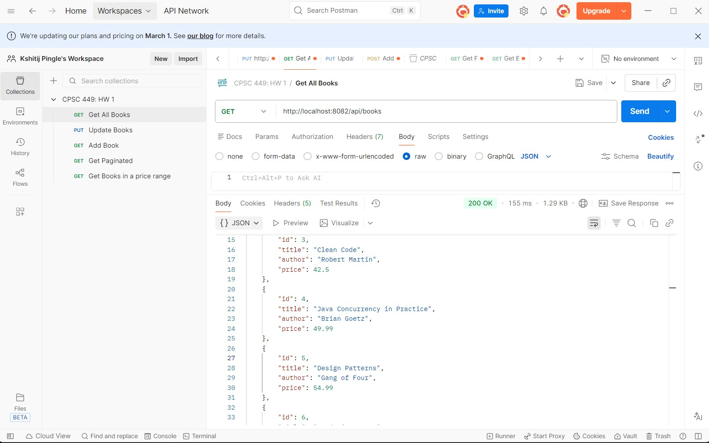
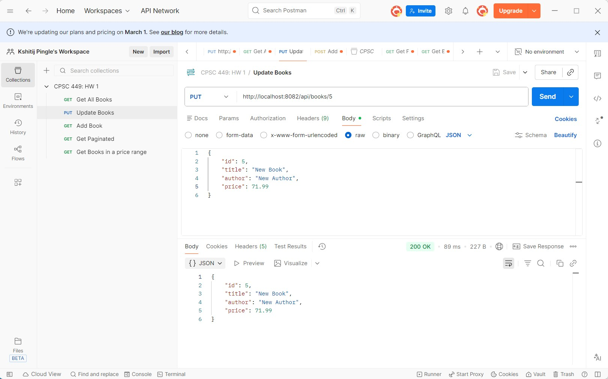
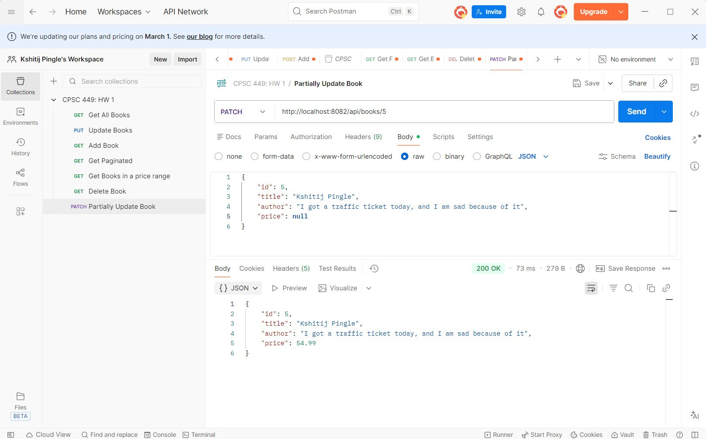
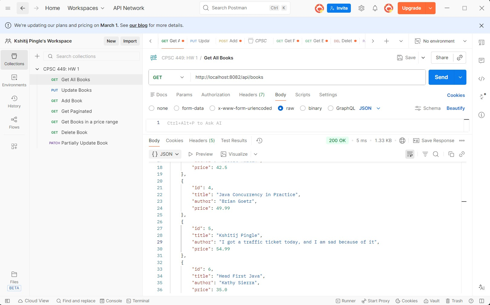
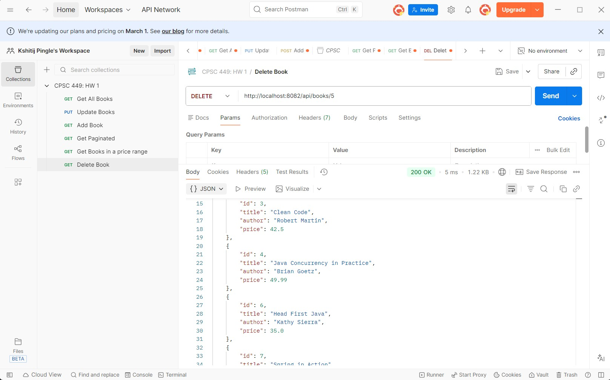
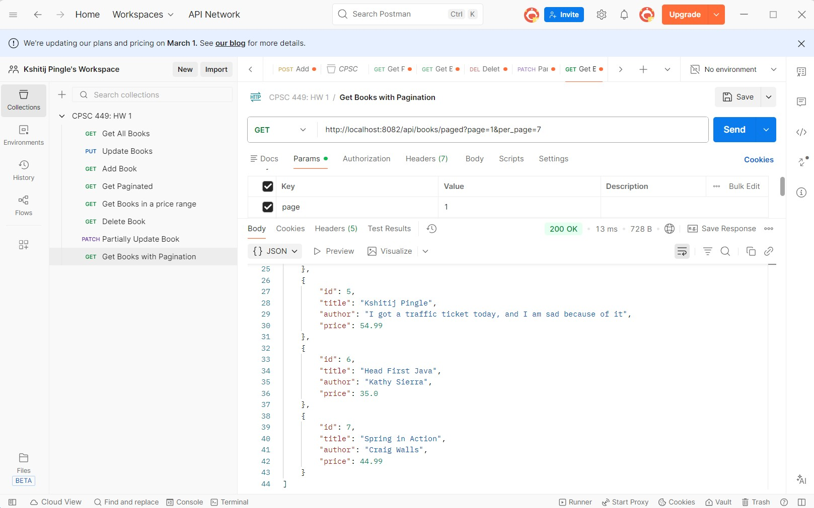
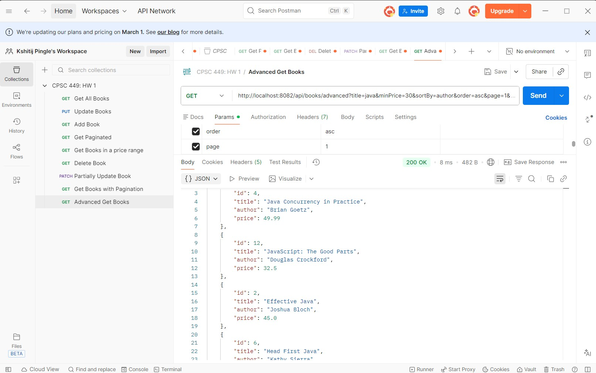

# CPSC 449 : Backend Engineering HW 1
By: Kshitij Pingle  
This GitHub repo is for my HW 1 code, I only coded inside BookController.Java  
I have also attached screenshots from Postman to show the endpoints are working as expected.  

**Note:** I put a whole lot of comments in my BookController.java because I have not used Java this much in 6 years, + I am brand new to streams and lambda expressions in Java

## Tasks Completed
- Made a PUT endpoint to update books
- Made a PATCH endpoint to partially update books
- Made a DELETE endpoint to delete books
- Made a GET endpoint with pagination
- Made an advanced GET endpoint with filtering, sorting, and pagination

## H2 Screenshots of working API endpoints
### 1. PUT endpoint

The above is a picture of all the books using a simple GET endpoint

The above is an image of sending the updated book using the PUT endpoint

### 2. PATCH endpoint

The above is an image of sending one partially updated book using the PATCH endpoint

The above is an image of all books after using the PATCH endpoint

### 3. DELETE endpoint

The above is an image of using the DELETE endpoint

### 4. GET endpoint with pagination

The above is an image of the GET endpoint returning all books with pagination and per_page limit being 7

### 5. Advanced GET with filtering, sorting, and pagination

The above is an image of the advanced GET with a few filters, sorting, and pagination args
